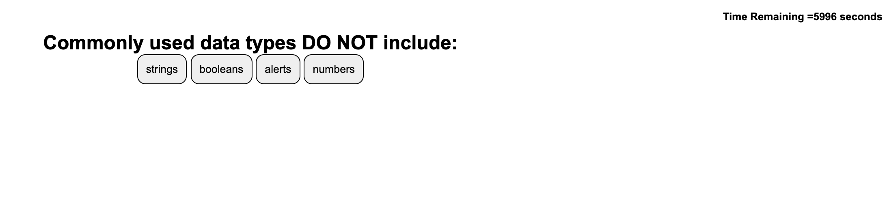

# homework-4 | JHU Bootcamp | Andrew Keiser

## Description
This is the fourth homework assignment from the Johns Hopkins Coding Bootcamp. The objective is to create a coding quiz that tallies the score and displays the final score on another page. There must be a timer that will end the game when expired. There needs to be a button to clear the final scores and the content needs to be dynamically created.

##Link
[Click Here ](https://webdev410.github.io/homework-4/)

##Screenshot

